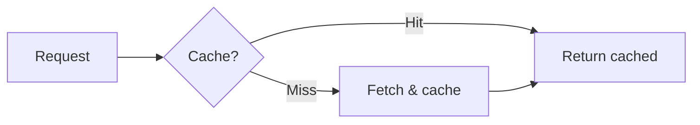
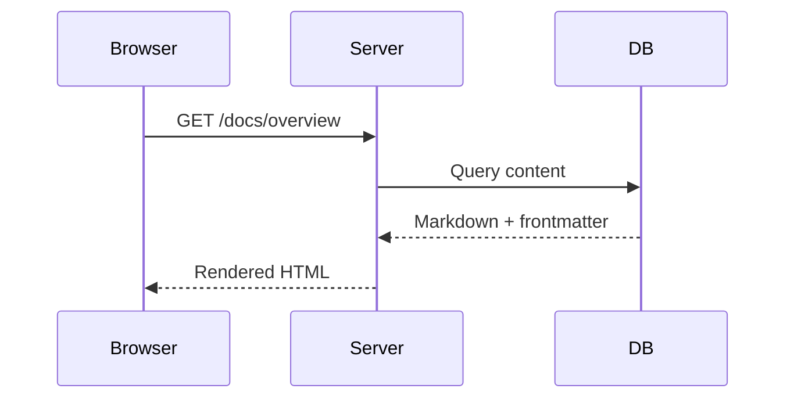
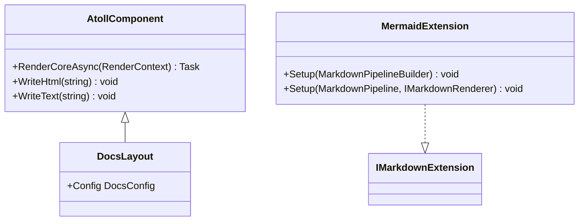
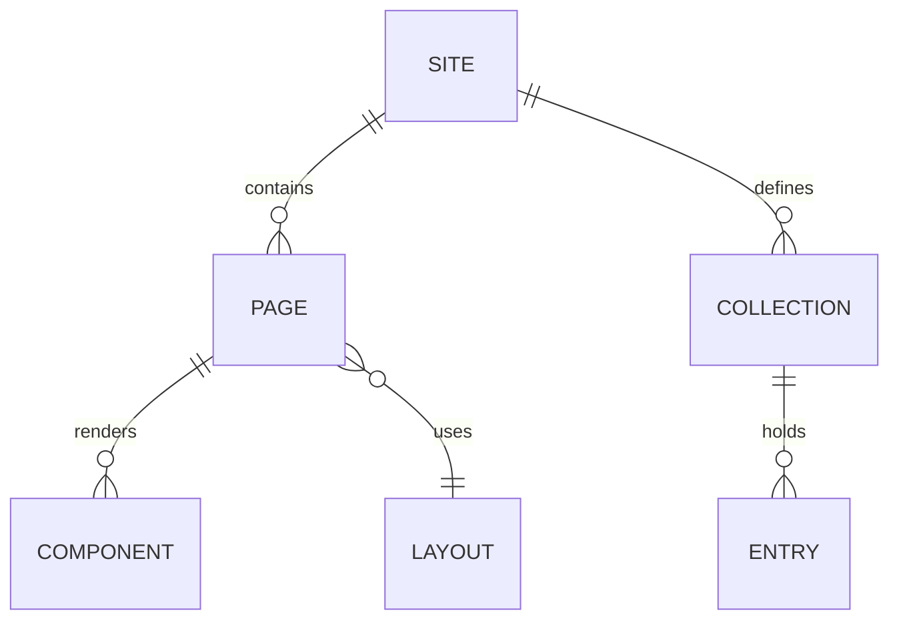
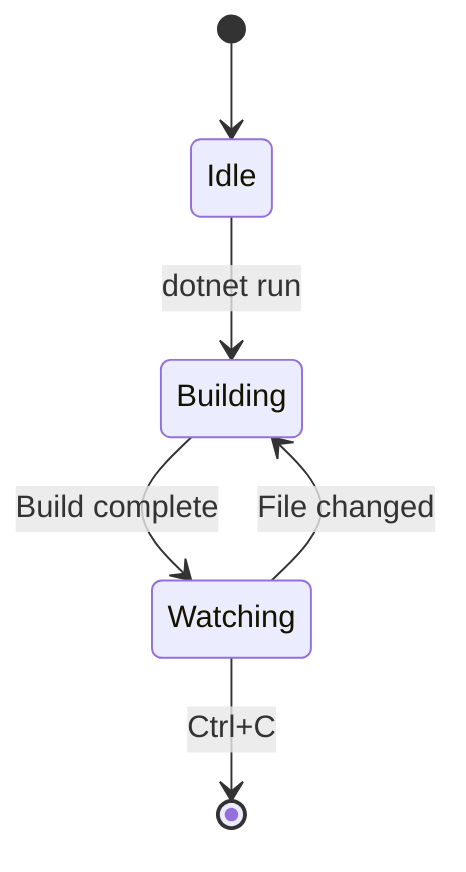

# Mermaid Overview

The `Atoll.Mermaid` plugin renders [Mermaid](https://mermaid.js.org/) diagrams from fenced code blocks in markdown. At build time, `` ```mermaid `` blocks are converted to `<pre class="mermaid">` elements. At page load, the Mermaid JS library (loaded from CDN) renders them as SVG diagrams.

| Feature | Description |
|---|---|
| **Zero JS by default** | No Mermaid JavaScript is loaded unless `EnableMermaid` is `true` |
| **Build-time transform** | Fenced code blocks become `<pre class="mermaid">` — no nested `<code>` element |
| **Theme sync** | Diagrams automatically re-render when the user toggles dark/light mode |
| **XSS safe** | Diagram content is HTML-encoded at build time; Mermaid reads `textContent` so encoding is transparent |

## Installation

Add a project reference to `Atoll.Mermaid`:

```xml
<ProjectReference Include="..\..\src\Atoll.Mermaid\Atoll.Mermaid.csproj" />
```

Register the island asset provider so the embedded initialisation script is copied to the output directory during build:

```csharp
using Atoll.Mermaid.Islands;

builder.Services.AddIslandAssetProvider<MermaidIslandAssetProvider>();
```

No additional NuGet packages are required. The JavaScript asset (`atoll-docs-mermaid-init.js`) is embedded in the assembly and served automatically via the `IIslandAssetProvider` pipeline.

## Enabling Mermaid

Set `EnableMermaid` to `true` in your `DocsConfig`:

```csharp
new DocsConfig
{
    EnableMermaid = true,
    // ...
}
```

When enabled, `DocsLayout` injects a module script tag that loads Mermaid from the jsDelivr CDN, initialises it with the current theme, and observes `data-theme` changes to re-render diagrams when the theme toggles.

When `EnableMermaid` is `false` (the default), no Mermaid-related JavaScript is loaded and fenced `mermaid` blocks render as plain code.

## Writing diagrams

Use a fenced code block with the `mermaid` language identifier:

````markdown

````

The language identifier is case-insensitive — `Mermaid`, `MERMAID`, and `mermaid` all work.

## Examples

The diagrams below are live — rendered by the Mermaid JS library at page load. Toggle the theme to see them re-render with updated colours.

### Flowchart


### Sequence diagram



### Class diagram



### Entity-relationship diagram



### State diagram



### Gantt chart

```mermaid
gantt
    title Site build pipeline
    dateFormat X
    axisFormat %s

    section Parse
    Load content       :a1, 0, 2
    Parse markdown     :a2, after a1, 3

    section Render
    Render components  :b1, after a2, 4
    Emit HTML          :b2, after b1, 2

    section Output
    Write files        :c1, after b2, 1
```



## Supported diagram types

Any diagram type supported by the Mermaid library works, including:

| Type | Identifier |
|---|---|
| Flowchart | `flowchart` / `graph` |
| Sequence diagram | `sequenceDiagram` |
| Class diagram | `classDiagram` |
| State diagram | `stateDiagram-v2` |
| Entity-relationship | `erDiagram` |
| Gantt chart | `gantt` |
| Pie chart | `pie` |
| Git graph | `gitGraph` |
| Mindmap | `mindmap` |
| Timeline | `timeline` |

See the [Mermaid documentation](https://mermaid.js.org/intro/) for the full list and syntax reference.

## How it works

The plugin is a Markdig pipeline extension with two parts:

1. **`MermaidExtension`** — registers a custom `MermaidCodeBlockRenderer` that replaces the default `CodeBlockRenderer` in the HTML renderer pipeline.

2. **`MermaidCodeBlockRenderer`** — inspects each code block. If the language identifier is `mermaid`, it emits `<pre class="mermaid">` with HTML-encoded content. All other code blocks fall through to the default Markdig renderer.

The client-side initialisation script (`mermaid-init.js`) does the following:

1. Imports Mermaid from `https://cdn.jsdelivr.net/npm/mermaid/dist/mermaid.esm.min.mjs`
2. Reads the current `data-theme` attribute to choose `dark` or `default` theme
3. Calls `mermaid.initialize({ startOnLoad: true, theme })`
4. Installs a `MutationObserver` on `<html>` to re-initialise and re-render when the theme changes

## Standalone usage

`Atoll.Mermaid` can be used independently of Lagoon. Add the extension to any Markdig pipeline:

```csharp
using Markdig;
using Atoll.Mermaid;

var pipeline = new MarkdownPipelineBuilder()
    .Use<MermaidExtension>()
    .Build();

var html = Markdown.ToHtml(markdown, pipeline);
```

This converts `` ```mermaid `` blocks to `<pre class="mermaid">` in the HTML output. You are responsible for loading the Mermaid JS library on the page.

## Security

Diagram content is HTML-encoded at build time. Characters like `<`, `>`, `&`, and `"` are replaced with their HTML entities (`&lt;`, `&gt;`, `&amp;`, `&quot;`). This prevents raw HTML injection from diagram source text.

The Mermaid library reads the element's `textContent` property, which automatically decodes entities, so encoding is transparent to diagram rendering.
