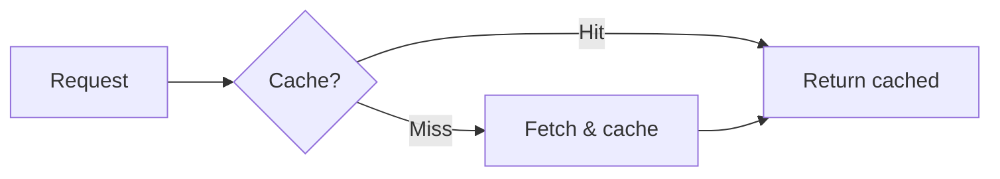
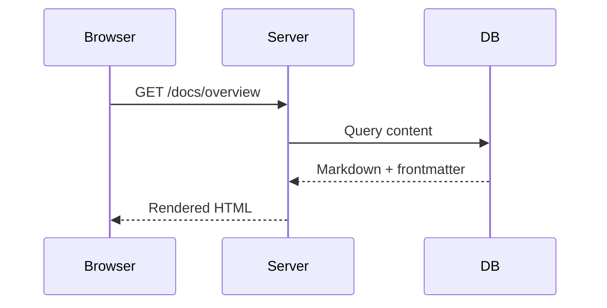
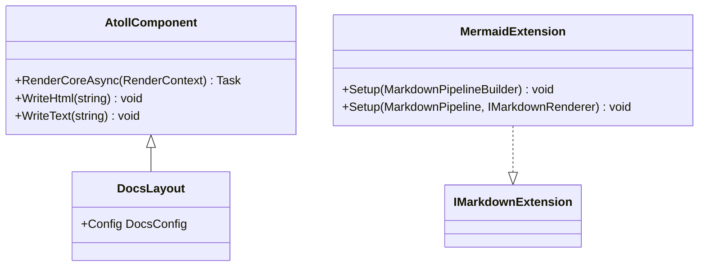
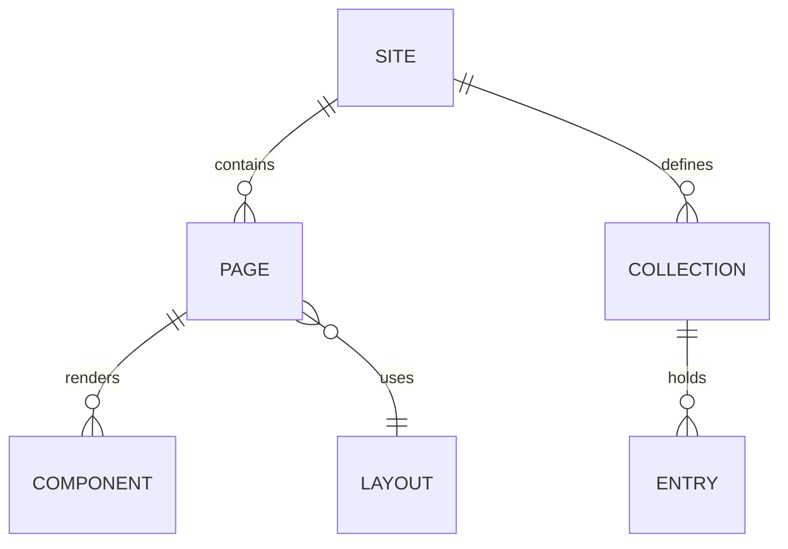
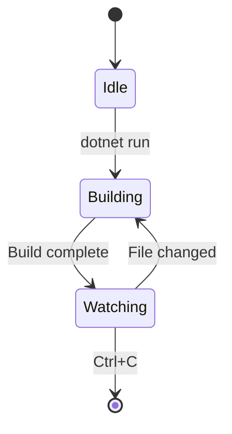

# Mermaid Overview

The `Atoll.Mermaid` plugin renders [Mermaid](https://mermaid.js.org/) diagrams from fenced code blocks in markdown. At build time, `` ```mermaid `` blocks are converted to `<pre class="mermaid">` elements. At page load, a pinned copy of the Mermaid JS library bundled with the package renders them as SVG diagrams. Nothing is loaded from a CDN.

| Feature | Description |
|---|---|
| **Zero JS by default** | No Mermaid JavaScript is loaded unless `EnableMermaid` is `true`, and pages without diagrams never download Mermaid |
| **Bundled and pinned** | A specific Mermaid release ships inside the package and is served from your site. Its files are checked against recorded hashes at build time |
| **Build-time transform** | Fenced code blocks become `<pre class="mermaid">` — no nested `<code>` element |
| **Theme sync** | Diagrams automatically re-render when the user toggles dark/light mode |
| **XSS safe** | Diagram content is HTML-encoded at build time; Mermaid reads `textContent` so encoding is transparent |

## Installation

Add the `Atoll.Mermaid` NuGet package:

```bash
dotnet add package Atoll.Mermaid
```

Or add directly to your `.csproj`:

```xml
<PackageReference Include="Atoll.Mermaid" Version="0.1.*" />
```

Register the island asset provider so the embedded initialisation script is copied to the output directory during build:

```csharp
using Atoll.Mermaid.Islands;

builder.Services.AddIslandAssetProvider<MermaidIslandAssetProvider>();
```

No additional NuGet packages are required. The initialisation script (`atoll-docs-mermaid-init.js`) and the bundled Mermaid build (`scripts/atoll-mermaid/<version>/`) are embedded in the assembly and served automatically via the `IIslandAssetProvider` pipeline.

## Enabling Mermaid

Set `EnableMermaid` to `true` in your `DocsConfig`:

```csharp
new DocsConfig
{
    EnableMermaid = true,
    // ...
}
```

When enabled, `DocsLayout` injects a small module script. On pages that contain a diagram, it loads the bundled Mermaid build from your site, initialises it with the current theme, and observes `data-theme` changes to re-render diagrams when the theme toggles. On pages without diagrams it does nothing.

When `EnableMermaid` is `false` (the default), no Mermaid-related JavaScript is loaded and fenced `mermaid` blocks render as plain code.

## Writing diagrams

Use a fenced code block with the `mermaid` language identifier:

````markdown

```mermaid
flowchart LR
    A[Request] --> B{Cache?}
    B -- Hit --> C[Return cached]
    B -- Miss --> D[Fetch & cache]
    D --> C
```
````

The language identifier is case-insensitive — `Mermaid`, `MERMAID`, and `mermaid` all work.

## Examples

The diagrams below are live — rendered by the Mermaid JS library at page load. Toggle the theme to see them re-render with updated colours.

### Flowchart


```mermaid
flowchart LR
    A[Request] --> B{Cache?}
    B -- Hit --> C[Return cached]
    B -- Miss --> D[Fetch & cache]
    D --> C
```

### Sequence diagram


```mermaid
sequenceDiagram
    participant Browser
    participant Server
    participant DB

    Browser->>Server: GET /docs/overview
    Server->>DB: Query content
    DB-->>Server: Markdown + frontmatter
    Server-->>Browser: Rendered HTML
```

### Class diagram


```mermaid
classDiagram
    class AtollComponent {
        +RenderCoreAsync(RenderContext) Task
        +WriteHtml(string) void
        +WriteText(string) void
    }
    class DocsLayout {
        +Config DocsConfig
    }
    class MermaidExtension {
        +Setup(MarkdownPipelineBuilder) void
        +Setup(MarkdownPipeline, IMarkdownRenderer) void
    }
    AtollComponent <|-- DocsLayout
    MermaidExtension ..|> IMarkdownExtension
```

### Entity-relationship diagram


```mermaid
erDiagram
    SITE ||--o{ PAGE : contains
    PAGE ||--o{ COMPONENT : renders
    PAGE }o--|| LAYOUT : uses
    SITE ||--o{ COLLECTION : defines
    COLLECTION ||--o{ ENTRY : holds
```

### State diagram


```mermaid
stateDiagram-v2
    [*] --> Idle
    Idle --> Building : dotnet run
    Building --> Watching : Build complete
    Watching --> Building : File changed
    Watching --> [*] : Ctrl+C
```

### Gantt chart


```mermaid
gantt
    title Site build pipeline
    dateFormat X
    axisFormat %s

    section Parse
    Load content       :a1, 0, 2
    Parse markdown     :a2, after a1, 3

    section Render
    Render components  :b1, after a2, 4
    Emit HTML          :b2, after b1, 2

    section Output
    Write files        :c1, after b2, 1
```

## Supported diagram types

Any diagram type supported by the Mermaid library works, including:

| Type | Identifier |
|---|---|
| Flowchart | `flowchart` / `graph` |
| Sequence diagram | `sequenceDiagram` |
| Class diagram | `classDiagram` |
| State diagram | `stateDiagram-v2` |
| Entity-relationship | `erDiagram` |
| Gantt chart | `gantt` |
| Pie chart | `pie` |
| Git graph | `gitGraph` |
| Mindmap | `mindmap` |
| Timeline | `timeline` |

See the [Mermaid documentation](https://mermaid.js.org/intro/) for the full list and syntax reference.

## How it works

The plugin is a Markdig pipeline extension with two parts:

1. **`MermaidExtension`** — registers a custom `MermaidCodeBlockRenderer` that replaces the default `CodeBlockRenderer` in the HTML renderer pipeline.

2. **`MermaidCodeBlockRenderer`** — inspects each code block. If the language identifier is `mermaid`, it emits `<pre class="mermaid">` with HTML-encoded content. All other code blocks fall through to the default Markdig renderer.

The client-side initialisation script (`mermaid-init.js`) does the following:

1. Looks for `<pre class="mermaid">` elements. If there are none, it stops, so Mermaid is never downloaded.
2. Loads Mermaid with a dynamic `import()`. By default it loads the bundled build from `/scripts/atoll-mermaid/<version>/mermaid.esm.min.mjs`. This is Mermaid's chunked ES module build, so a page only downloads the chunks its diagram types need.
3. Reads the current `data-theme` attribute to choose `dark` or `default` theme
4. Calls `mermaid.initialize({ startOnLoad: false, securityLevel: 'strict', theme })` and then `mermaid.run()`. Render errors are caught and logged to the console.
5. Installs a `MutationObserver` on `<html>` to re-render when the theme changes. Renders are queued so they never overlap, and a render is skipped if the theme hasn't actually changed.

## Using a different Mermaid build

To load Mermaid from somewhere else, for example a newer version you host yourself, set `MermaidModuleUrl` to the URL of a `mermaid.esm.min.mjs` file:

```csharp
new DocsConfig
{
    EnableMermaid = true,
    MermaidModuleUrl = "/vendor/mermaid/12.1.0/mermaid.esm.min.mjs",
}
```

The value must be an absolute `http`/`https` URL or a root-relative path. Lagoon emits it as a `data-module-src` attribute on the init script tag. Outside Lagoon, add `data-atoll-mermaid data-module-src="..."` to your own `<script type="module">` tag.

When you override the module URL, the bundled build's integrity checks no longer apply, and your Content Security Policy must allow the origin you load from.

## Content Security Policy

With the bundled build, Mermaid is served from your own origin, so `script-src 'self'` is enough and no third-party origin such as `cdn.jsdelivr.net` needs to be allowed. Mermaid injects inline `<style>` elements into the SVGs it renders, so `style-src` must still include `'unsafe-inline'`. Mermaid does not need `'unsafe-eval'`.

The bundled files use the `.mjs` extension. Your host must serve `.mjs` files with a JavaScript MIME type such as `text/javascript`, or browsers will refuse to load them as modules. GitHub Pages, Netlify, Cloudflare Pages and the Atoll dev server already do this.

## Upgrading the bundled Mermaid

The bundled files live in `src/Atoll.Mermaid/Islands/Assets/vendor/mermaid/`, next to `manifest.json`. The manifest records the npm tarball URL, the tarball's `sha512` integrity hash from the npm registry, and a SHA-256 hash for every bundled file. To upgrade, run the update script from the repository root (PowerShell 7+):

```powershell
./eng/update-mermaid.ps1 -Version 12.0.1
```

The script:

1. Downloads the `mermaid` tarball and checks it against the integrity hash the registry publishes.
2. Replaces the vendored files with `dist/mermaid.esm.min.mjs`, `dist/chunks/mermaid.esm.min/*.mjs` and `LICENSE`.
3. Regenerates `manifest.json`.
4. Updates `BUNDLED_VERSION` in `mermaid-init.js`.

Then run the `Atoll.Mermaid.Tests` tests. They fail if any bundled file doesn't match its recorded hash, if an unlisted file is embedded, if a chunk imports a file that isn't bundled, or if the init script's version doesn't match the manifest. Check the diagrams on this page in both themes before committing. Don't edit the vendored files by hand.

## Standalone usage

`Atoll.Mermaid` can be used independently of Lagoon. Add the extension to any Markdig pipeline:

```csharp
using Markdig;
using Atoll.Mermaid;

var pipeline = new MarkdownPipelineBuilder()
    .Use<MermaidExtension>()
    .Build();

var html = Markdown.ToHtml(markdown, pipeline);
```

This converts `` ```mermaid `` blocks to `<pre class="mermaid">` in the HTML output. You are responsible for loading the Mermaid JS library on the page. To use the bundled build, register `MermaidIslandAssetProvider` and add `<script src="/scripts/atoll-docs-mermaid-init.js" type="module" data-atoll-mermaid></script>` to your pages.

## Security

Diagram content is HTML-encoded at build time. Characters like `<`, `>`, `&`, and `"` are replaced with their HTML entities (`&lt;`, `&gt;`, `&amp;`, `&quot;`). This prevents raw HTML injection from diagram source text.

The Mermaid library reads the element's `textContent` property, which automatically decodes entities, so encoding is transparent to diagram rendering.
